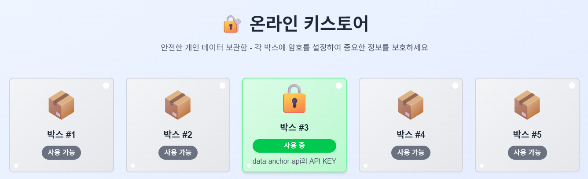
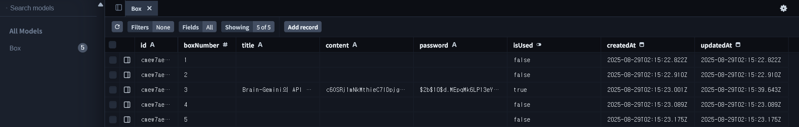

# 온라인 키박스 (Online Keybox) - ✨[바로가기](https://online-keybox.vercel.app)

> ⚠️ **이 프로젝트는 학습/실습/데모용 예제입니다. 실제 비밀번호, 개인키, 민감정보를 저장하지 마세요.**
> - 데이터는 평문으로 데이터베이스에 저장되며, 별도의 암호화/해싱/인증/인가가 적용되어 있지 않습니다.
> - 운영자(배포자)가 모든 데이터에 접근할 수 있습니다.
> - 데이터 유출, 손실, 해킹 등에 대해 서비스 제공자는 책임지지 않습니다.




> **개인용 암호화 문자열 보관함 - Next.js, Prisma, PostgreSQL 기반**

---

## 🗝️ 프로젝트 소개

**온라인 키스토어**는 사용자가 웹 브라우저에서 안전하게 중요한 문자열(비밀번호, 보안코드, 메모 등)을 보관할 수 있는 개인용 키박스 서비스입니다. 각 박스는 개별 암호로 보호되며, 서버리스 환경(Vercel)에서 동작하도록 설계되었습니다.

---

## 🚀 주요 기능
- **5개 박스 제공**: 각 박스는 '사용 가능' 또는 '사용 중' 상태로 표시
- **암호 설정/입력**: 박스별로 개별 암호 설정 및 확인
- **제목/내용 저장**: 최대 3000자까지 입력 가능, 수정/삭제 지원
- **저장 전 이탈 경고**: 저장하지 않은 변경사항이 있을 때 알림
- **반응형 UI**: 모바일/데스크탑 모두 최적화
- **데이터 영속성**: PostgreSQL + Prisma로 안전하게 저장

---

## 🛠️ 기술 스택
- **Frontend**: Next.js 15, React, TypeScript, TailwindCSS
- **Backend**: Next.js API Route (서버리스), Prisma ORM
- **Database**: PostgreSQL (Neon)
- **Infra**: Vercel (서버리스 배포)

---

## 💡 사용 목적 및 활용 예시
- 여러 사이트의 비밀번호, OTP, 보안코드, 중요한 메모 등 민감한 정보를 안전하게 보관
- 서버리스/풀스택 개발 및 DB 연동 학습용 예제
- 개인용 암호화 메모장, 간단한 패스워드 매니저 대체

---

## 📦 프로젝트 구조
```
app/
  components/      # UI 컴포넌트 (BoxGrid, BoxModal, PasswordModal)
  lib/             # Prisma 클라이언트
  api/boxes/       # RESTful API Route
  page.tsx         # 메인 페이지
prisma/
  schema.prisma    # Prisma 데이터베이스 스키마
.env               # DB 접속 정보
```

---

## ⚡ 빠른 시작
1. `.env`에 DATABASE_URL 설정
2. `npm install`
3. `npx prisma migrate dev --name init`
4. `npm run dev`

---

## 📝 참고 문서
- [docs/ONLINE_KEYBOX_IMPLEMENTATION.md](docs/ONLINE_KEYBOX_IMPLEMENTATION.md) - 전체 구현 내역 및 기술 상세

---

## 🧑‍💻 만든이와 라이선스
- **만든이**: [bnex](https://github.com/bnex)
- **라이선스**: MIT

---

## 🔒 보안 관련 안내
- 박스 비밀번호(암호)는 bcrypt 해시로 안전하게 저장됩니다. (복원 불가, 비교만 가능)
- 박스 내부의 내용(메모, 개인키 등)은 여전히 평문으로 저장되므로 민감정보 저장은 권장하지 않습니다.
- 인증/인가, 키 관리, 내용 암호화 등은 미구현 상태입니다.

---

## 🔐 클라이언트 암호화(End-to-End Encryption)
- 박스 내부의 내용(메모, 개인키 등)은 사용자의 비밀번호에서 파생된 키로 브라우저에서 암호화되어 저장됩니다.
- 서버/DB/운영자는 암호문만 보관, 평문 데이터는 볼 수 없습니다.
- 사용자는 기존과 동일하게 비밀번호만 입력, 내부적으로 자동 암호화/복호화 적용
- 자세한 원리와 구현 내역은 [docs/CLIENT_SIDE_ENCRYPTION.md](docs/CLIENT_SIDE_ENCRYPTION.md) 참고

---

## 🔑 단일 비밀번호 기반 E2EE 구조
- 박스에 접근(열기)할 때 입력한 비밀번호 하나로 인증(bcrypt)과 내용 암호화/복호화(키 파생, AES-GCM)가 모두 자동 처리됩니다.
- 사용자는 한 번만 비밀번호를 입력하면 되고, 내부적으로 인증과 암호화/복호화가 모두 처리됩니다.
- 자세한 원리와 구현 내역은 [docs/ONE_PASSWORD_E2EE.md](docs/ONE_PASSWORD_E2EE.md) 참고

---

> 이 프로젝트는 누구나 참고/활용할 수 있도록 오픈소스로 공개되어 있습니다.
